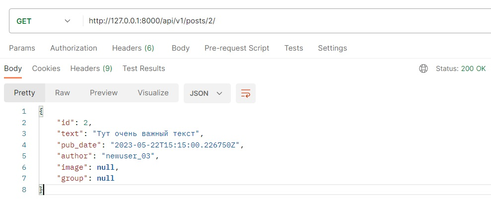

# API Yatube

Проект Yatube — это платформа для публикаций, блог. 
У пользователей есть возможность публиковать и управлять записями. 

В проекте `api_yatube` есть приложение `posts` с описанием моделей Yatube.
Реализация логики API вынесена в отдельное приложение `api`.

API доступен только аутентифицированным пользователям.
Аутентифицированный пользователь авторизован на изменение и удаление своего контента,
в остальных случаях доступ предоставляется только для чтения.


## Используемые технологии и библиотеки

* [Django](https://docs.djangoproject.com/en/4.2/) | 3.2.16
* [pytest](https://docs.pytest.org/en/7.1.x/contents.html) | 6.2.4
* [pytest-pythonpath](https://pypi.org/project/pytest-pythonpath/) | 0.7.3
* [pytest-django](https://pypi.org/project/pytest-django/) | 4.4.0
* [djangorestframework](https://www.django-rest-framework.org/) | 3.12.4`
* [djangorestframework-simplejwt](https://django-rest-framework-simplejwt.readthedocs.io/en/latest/) | 4.7.2
* [Pillow](https://pillow.readthedocs.io/en/stable/) | 9.3.0
* [PyJWT](https://pyjwt.readthedocs.io/en/stable/) | 2.1.0
* [requests](https://requests.readthedocs.io/en/latest/) | 2.26.0


## Как запустить проект

Клонировать репозиторий и перейти в него в командной строке:

```
git clone https://github.com/Lozhkin-pa/api_final_yatube.git
```

```
cd api_final_yatube
```

Cоздать и активировать виртуальное окружение:

```
python3 -m venv env
```

* Если у вас Linux/macOS

    ```
    source env/bin/activate
    ```

* Если у вас windows

    ```
    source env/scripts/activate
    ```

```
python3 -m pip install --upgrade pip
```

Установить зависимости из файла requirements.txt:

```
pip install -r requirements.txt
```

Выполнить миграции:

```
python3 manage.py migrate
```

Запустить проект:

```
python3 manage.py runserver
```


## Примеры запросов

Для взаимодействия с ресурсами описаны и настроены эндпоинты:

* `api/v1/jwt/create/` (POST): передаём логин и пароль, получаем токен.


* `api/v1/posts/` (GET, POST): получаем список всех постов или создаём новый пост.


* `api/v1/posts/{post_id}/` (GET, PUT, PATCH, DELETE): получаем, редактируем или удаляем пост по id.


* `api/v1/groups/` (GET): получаем список всех групп.

* `api/v1/groups/{group_id}/` (GET): получаем информацию о группе по id.

* `api/v1/posts/{post_id}/comments/` (GET, POST): получаем список всех комментариев поста с id=post_id или создаём новый, указав id поста, который хотим прокомментировать.


* `api/v1/posts/{post_id}/comments/{comment_id}/` (GET, PUT, PATCH, DELETE): получаем, редактируем или удаляем комментарий по id у поста с id=post_id.


* `api/v1/follow/` (GET, POST): получаем все подписки пользователя, сделавшего запрос, или подписываемся на пользователя переданного в теле запроса.


## Автор

Павел Ложкин

[lozhkin.pa@gmail.com](mailto:lozhkin.pa@gmail.com)

[github.com/Lozhkin-pa](https://github.com/Lozhkin-pa)